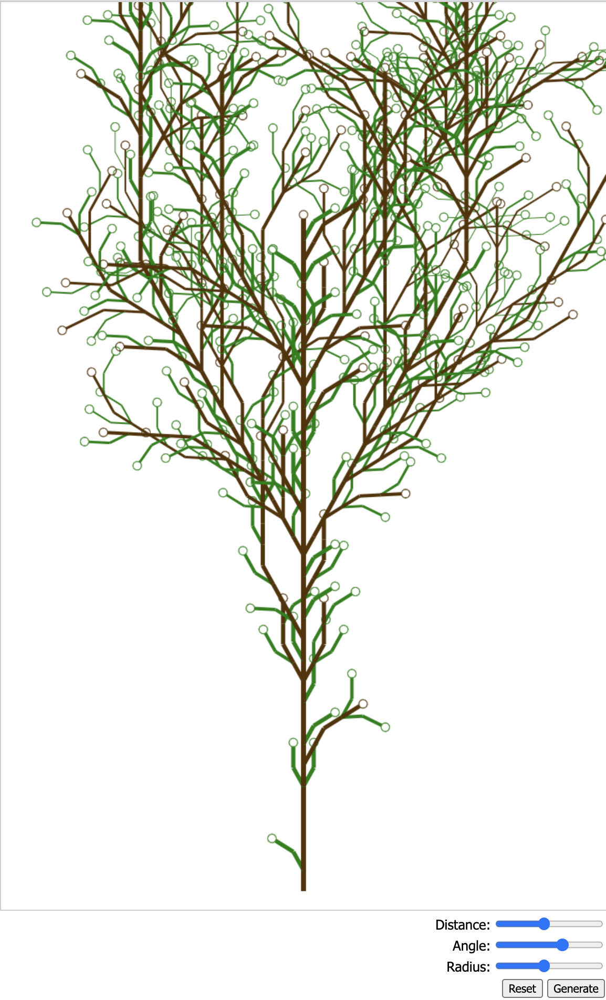

L-System Toy
================================================

A toy webpage for generating tree-like graphics 
using L-Systems.

Technology
-----------------------------------------------

| For        | Name           |
|:-----------|:---------------|
| Compiling  | Webpack        |
| Developing | Webpack        |
| Testing    | Cypress        |
| JavaScript | Babel          |
| CSS        | SCSS           |
| Hosting    | GitHub Pages   |
| Automation | GitHub Actions |
